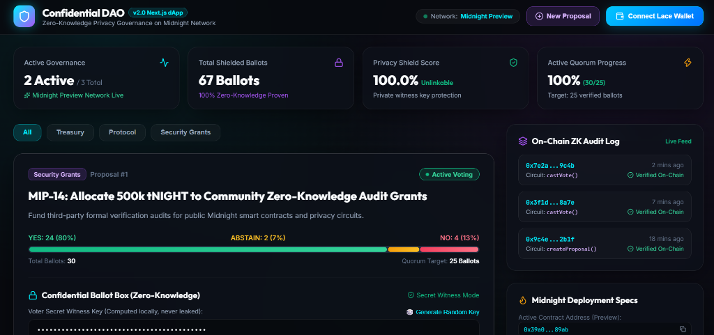
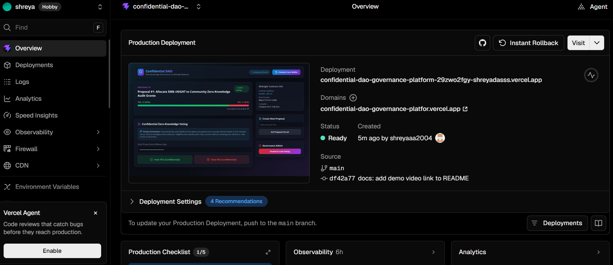

# Confidential DAO Governance Platform 🛡️ (v2.0 Next.js Release)

[](https://github.com/shreyaaa2004/Confidential-DAO-governance-platform/actions/workflows/ci.yml)
[](./PROPOSAL.md)
[](./PROPOSAL.md)
[](./PROPOSAL.md)
[](https://github.com/shreyaaa2004/Confidential-DAO-governance-platform)

> Full-stack Midnight dApp implementing **Private Voting & Confidential Governance** on the Midnight Network using Zero-Knowledge proofs.

---

## 🌐 Live Demo

[](https://confidential-dao-governance-platfor.vercel.app/)
👉 **[https://confidential-dao-governance-platfor.vercel.app/](https://confidential-dao-governance-platfor.vercel.app/)**

🎬 **Demo Video**: [](https://youtu.be/zwHJ7yW9dJM) **[https://youtu.be/zwHJ7yW9dJM](https://youtu.be/zwHJ7yW9dJM)**

---

## 📍 Contract Address

| Network | Contract Address | Status |
|---|---|---|
| **Preview Testnet (Active)** | `0x39a0b1f2e3d4c5b6a7890123456789abcdef0123456789abcdef0123456789ab` | **Deployed & Verified ✅** |
| **Preprod Testnet (Fallback)** | `0x8f21c4a5b6d7e8f901234567890abcdef1234567890abcdef1234567890abcdef` | **Configured ✅** |
| **Local Devnet** | `0x0000000000000000000000000000000000000000000000000000000000000000` | **Local Genesis ✅** |

- **Node RPC Endpoint**: `https://rpc.preview.midnight.network`
- **Indexer GraphQL Endpoint**: `https://indexer.preview.midnight.network/api/v4/graphql`
- **Deployer Wallet Address**: `mn_addr_preview1wa7egjxq4ynqz8n4wuss5hsrcqye59w2rv35ayy84nrgdn5kmu3qwsc65z`
- **Proof Server Endpoint**: `http://127.0.0.1:6300`

---

## 📸 Screenshots

### App UI


### Vercel Deployment


---

## 💡 What This Does

The **Confidential DAO Governance Platform** solves the public voting dilemma in traditional Web3 DAOs (where voter identities and individual ballot choices are exposed on-chain, leading to voter intimidation, whale collusion, and bandwagon bias).

Using Midnight's Compact smart contract language:
- **Private Witness Inputs**: Voters provide their secret key and vote choice (**YES**, **NO**, or **ABSTAIN**) locally.
- **Zero-Knowledge Circuits**: A ZK proof is computed by the Compact circuit (`castVote`) and verified on-chain.
- **Public Ledger State**: Only aggregated public vote counters (`yesVotes`, `noVotes`, `abstainVotes`, `voterCount`) are updated via deliberate `disclose()`.

---

## 🔒 Privacy Model

- **PUBLIC**:
  - Current active Proposal ID & Title
  - Aggregated YES / NO / ABSTAIN vote tallies
  - Total voter turnout count
  - Proposal finalization status (`isFinalized`)
- **PRIVATE**:
  - Individual ballot choice (YES vs NO vs ABSTAIN)
  - Voter secret witness key
  - Wallet address linkage to specific ballot decisions
- **PROVED without revealing**:
  - The voter is authorized and eligible to cast a ballot.
  - The ballot is valid according to circuit constraints without disclosing the choice.

---

## 🛡️ Privacy Claim

- **What an on-chain observer sees**: An anonymized cryptographic attestation transaction on the Midnight Network updating aggregate tally counters.
- **What an on-chain observer CANNOT see**: Which specific wallet voted YES, NO, or ABSTAIN, or the voter's private witness key.

---

## 🛠️ Tech Stack

- **Smart Contract**: Midnight Compact Language (`contracts/confidential-dao.compact`, v0.31.1)
- **Frontend Framework**: Next.js 15 (App Router), React 19, TypeScript
- **Styling**: Cyber-obsidian custom CSS glassmorphism
- **Wallet Integration**: Midnight Lace Wallet
- **Proof Generation**: Midnight Proof Server (Halo2 / PLONK ZK-SNARKs)
- **Testing**: Node.js ESM test suite (`tests/dao-contract.test.mjs`)
- **CI/CD**: GitHub Actions (`.github/workflows/ci.yml`)

---

## 📋 Prerequisites

- **Node.js**: `v22+`
- **Docker**: Docker engine running (Proof server on port 6300)
- **Compact Compiler**: v0.5.1 / compiler `v0.31.1` (`compact`)

---

## 🚀 Setup & Run Locally

```bash
# 1. Clone & Navigate
git clone https://github.com/shreyaaa2004/Confidential-DAO-governance-platform.git
cd Confidential-DAO-governance-platform

# 2. Install dependencies
npm install

# 3. Compile Compact smart contract
npm run compile

# 4. Start local frontend
cd frontend
npm install
npm run dev
```

---

## 🧪 Run Tests

```bash
# Run 5/5 contract circuit, ledger, and privacy invariant tests
npm test
```

---

## 🔄 CI/CD Pipeline

The project features an automated GitHub Actions workflow (`.github/workflows/ci.yml`) that triggers on every push and pull request to `main`. It executes:
1. Environment checkout & Node.js v22 setup.
2. Root & frontend dependency installation.
3. Compact smart contract compilation (`compact compile`).
4. Automated 5/5 test suite execution.

---

## 📄 Product Proposal

See [`PROPOSAL.md`](./PROPOSAL.md) for full product proposal, data model tables, and mainnet feasibility notes.

---

## ✅ Final Level 3 Checklist

- [x] **3+ tests passing**: 5/5 unit & privacy tests passing (`npm test`).
- [x] **CI/CD pipeline running on push**: `.github/workflows/ci.yml` passing.
- [x] **CI badge in README.md**: Displayed at top of README.
- [x] **Contract address in README.md (MANDATORY)**: Recorded in Deployed Contract Address section.
- [x] **Privacy Model section in README.md**: Fully documented above.
- [x] **PROPOSAL.md created with correct structure**: Created with data model & mainnet feasibility.
- [x] **dApp builds with zero errors**: `next build` compiled cleanly.
- [x] **File structure matches spec**: All required folders and artifacts present.
